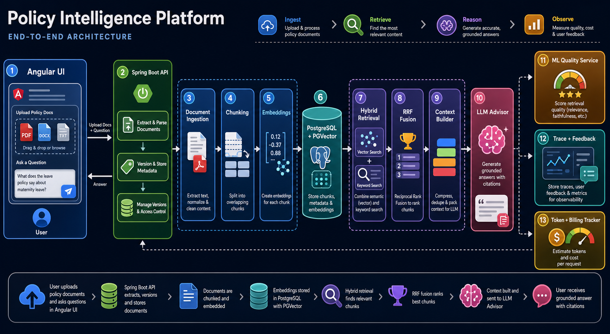

# Policy Intelligence Platform

[](https://github.com/Shibaji1987/policy-intelligence-api/actions/workflows/ci.yml)


An enterprise-style RAG platform for ingesting policy documents, chunking them,
embedding them, retrieving relevant policy context with PGVector cosine search,
and generating grounded advisor answers with source attribution.



This repository owns the backend API and the local full-stack Docker
orchestration. The complete project is split into three side-by-side repos:

```text
policy-intelligence-api
policy-intelligence-ui
policy-intelligence-ml
```

## Repos To Clone

Clone all three repos into the same parent folder. The folder names must stay
side-by-side because Docker Compose in the API repo references the UI and ML
repos by relative paths.

Required repos:

```text
policy-intelligence-api
policy-intelligence-ui
policy-intelligence-ml
```

Expected local folder layout:

```text
some-parent-folder/
|-- policy-intelligence-api/
|-- policy-intelligence-ui/
`-- policy-intelligence-ml/
```

Example local workspace:

```text
policy-intelligence-workspace/
|-- policy-intelligence-api/
|-- policy-intelligence-ui/
`-- policy-intelligence-ml/
```

Example clone flow:

```bash
mkdir -p policy-intelligence-workspace
cd policy-intelligence-workspace

git clone <api-repo-url> policy-intelligence-api
git clone <ui-repo-url> policy-intelligence-ui
git clone <ml-repo-url> policy-intelligence-ml

cd policy-intelligence-api
sh scripts/start-stack.sh
```

Replace `<api-repo-url>`, `<ui-repo-url>`, and `<ml-repo-url>` with the actual
GitHub repository URLs after the repos are pushed.

## Why This Project Exists

Most simple RAG demos stop at "upload a file and ask a question." This project
goes further and demonstrates the engineering pieces needed for a serious
enterprise knowledge platform:

- document ingestion with immutable versions
- PDF, TXT, and Markdown extraction
- deterministic chunking strategies
- embedding lifecycle tracking
- embedding retries and failure reasons
- PGVector-backed semantic retrieval
- cosine similarity search in the database
- hybrid retrieval that blends PGVector cosine similarity with Postgres
  full-text keyword score
- metadata filters for tenant, department, region, document type, and
  classification
- multi-query advisor retrieval, parent-child neighbor expansion, and
  deterministic reranking before context selection
- request governance from `X-Tenant-Id`, `X-User-Id`, and optional allowed
  metadata headers
- context filtering before LLM calls, including deduplication, document diversity,
  token budget, and final chunk capping
- answer verification with unsupported-claim heuristics before trace completion
- LLM final answer generation from retrieved source chunks
- source attribution for auditability
- retrieval trace storage with retrieved/used/discarded source details and latency
  metrics
- human feedback collection on retrieval traces
- golden-question evaluation runner
- ML service integration for retrieval-quality prediction
- Dockerized API, UI, ML, and database
- local secrets kept out of Git
- startup, shutdown, restart, and logs scripts

The goal is to show how an enterprise RAG system is shaped, not just that an LLM
can answer a question. It gives you a concrete project to discuss backend
architecture, vector search, observability, ML feedback loops, containerization,
and deployment readiness.

## What It Demonstrates

The platform demonstrates these capabilities:

```text
Upload policy document
  -> extract text
  -> chunk text
  -> generate embeddings
  -> store chunks and 1536-d vectors in PostgreSQL/PGVector
  -> search by semantic similarity using cosine distance plus keyword scoring
  -> plan multiple retrieval queries
  -> expand neighboring chunks for parent-child context
  -> rerank and reduce top candidates into the best 5-8 chunks
  -> call LLM for final answer
  -> save trace, sources, and retrieval quality
```

The UI lets a user upload policy files, inspect document versions, view chunks,
run vector search directly, and ask the advisor for a final grounded answer.

The API owns ingestion, retrieval, advisor orchestration, tracing, and service
integration.

The ML service is intentionally separate. Today it predicts whether retrieval
quality looks good or bad based on retrieval features. Over time it can be
trained on real feedback from `retrieval_trace` and `retrieval_feedback`.

## Simple Architecture Flow

```text
Browser / Angular UI
  |
  | 1. Upload document or ask question
  v
Spring Boot API
  |
  | 2. Extract text from PDF/TXT/Markdown
  | 3. Create immutable document version
  | 4. Split text into chunks
  | 5. Generate embeddings for chunks
  v
PostgreSQL + PGVector
  |
  | 6. Store document, version, chunk, vector, trace data
  | 7. Run hybrid vector + keyword search using cosine distance and full text
  v
Advisor Pipeline
  |
  | 8. Refine query
  | 9. Generate multiple retrieval queries
  | 10. Retrieve top matching chunks
  | 11. Expand neighbor chunks for broader source sections
  | 12. Rerank, deduplicate, diversify, and budget retrieved chunks
  | 13. Send selected text chunks to LLM
  | 14. Verify source citation shape
  | 15. Ask ML service to score retrieval quality
  v
Trace + Response
  |
  | 16. Save trace, sources, similarity scores, ML label, and verification status
  v
UI displays answer, sources, chunks, and retrieval quality
```

Important distinction:

```text
PGVector receives numeric embeddings and performs cosine similarity search.
The LLM receives the retrieved human-readable text chunks, not raw vectors.
```

## Runtime Components

The Docker stack runs:

```text
postgres      PostgreSQL with PGVector extension
ml-service    FastAPI ML service for retrieval quality scoring
api           Spring Boot backend
ui            Angular production build served by Nginx
```

## Key APIs

Direct vector search:

```text
GET /api/v1/retrieval/search?query=...&topK=5&tenantId=default
```

Full advisor flow with LLM answer generation:

```text
POST /api/v1/advisor
GET  /api/v1/advisor/stream?question=...
```

ML health through API:

```text
GET /api/v1/ml/health
```

Recent retrieval traces:

```text
GET /api/v1/retrieval-traces?limit=5
GET /api/v1/retrieval-traces/{traceId}
POST /api/v1/retrieval-traces/{traceId}/feedback
```

Golden-question evaluation starter:

```text
GET /api/v1/evaluations/golden-questions
POST /api/v1/evaluations/run-golden-questions
```

Near-duplicate retrieval stress test:

```bash
sh scripts/load-confusing-corpus.sh
curl.exe -X POST http://localhost:8080/api/v1/evaluations/run-golden-questions
```

The confusing corpus lives in `docs/evaluation/confusing-corpus`. It contains
closely related policies for contractor production access, employee production
access, contractor sandbox data, vendor analytics data sharing, and employee
break-glass access. Good retrieval should cite the policy that matches the
actor, environment, data type, and approval path in the question.

Governance headers for local/dev testing:

```text
X-User-Id: demo-user
X-Tenant-Id: default
X-Allowed-Departments: Security,Compliance
X-Allowed-Regions: Global,Canada
X-Allowed-Classifications: Internal,Restricted
```

Header scopes are enforced by default. If a request asks for a restricted
metadata value, the value must appear in the matching `X-Allowed-*` header.
For frictionless local-only demos, this can be disabled explicitly:

```text
SECURITY_ENFORCE_HEADER_SCOPES=false
```

JWT API authentication is available through Spring Security. Local Docker keeps
it disabled unless you opt in:

```text
SECURITY_ENABLED=true
SPRING_SECURITY_OAUTH2_RESOURCESERVER_JWT_ISSUER_URI=https://your-issuer.example.com/
```

When enabled, the main API role boundaries are:

```text
ROLE_DOCUMENT_ADMIN  -> document ingestion, embeddings, cache operations
ROLE_ADVISOR_USER    -> advisor, retrieval, traces, document read APIs
ROLE_EVALUATION_USER -> evaluation APIs
ROLE_ACTUATOR_ADMIN  -> protected actuator endpoints
ROLE_API_DOCS        -> Swagger/OpenAPI UI
```

Embedding operations:

```text
POST /api/v1/embeddings/backfill
POST /api/v1/embeddings/retry-failed
```

Document APIs:

```text
POST /api/v1/documents
GET  /api/v1/documents?page=0&size=25
GET  /api/v1/documents/{documentId}/versions
GET  /api/v1/documents/versions/{versionId}/chunks
```

Advisor streaming uses a POST-to-session flow so long questions are not placed
in query strings:

```text
POST /api/v1/advisor/stream      -> { "streamId": "..." }
GET  /api/v1/advisor/stream/{id} -> text/event-stream
```

## Current vertical slice

- Java 21 and Spring Boot 3.5
- PostgreSQL with PGVector
- Flyway-owned schema
- PDF, TXT, and Markdown text extraction
- Fixed-size, sliding-window, and sentence-aware chunking
- Immutable document versions
- Old chunk deactivation
- Per-tenant corpus version increments for cache invalidation
- Embedding lifecycle state (`PENDING`, `COMPLETED`, `FAILED`)
- Embedding retry endpoint and stored failure reason
- Vector retrieval with cosine distance
- Advisor pipeline with LLM-backed final answer generation and extractive fallback
- Context selection with exact discard reasons
- Retrieval traces with source ranks, context ranks, discard reasons, and latency
  metrics
- ML retrieval-quality prediction

## Module structure

```text
com.shibajide.policyintelligence
|-- advisor
|-- chunking
|-- context
|-- document
|   |-- api
|   |-- application
|   |-- domain
|   `-- infrastructure
|-- embedding
|-- ml
|-- retrieval
|-- trace
`-- shared
    `-- api
```

Modules communicate through application services and records. JPA repositories
remain infrastructure details. This keeps the modular monolith easy to split
only if operational evidence later justifies it.

## Data model

```text
Document 1 --- * DocumentVersion 1 --- * DocumentChunk

DocumentVersion is immutable.
Only chunks belonging to the latest version are active.
CorpusState is locked and incremented in the version transaction.
```

Chunks store a 1536-dimensional PGVector embedding. Retrieval uses PGVector's cosine-distance
operator:

```sql
chunk.embedding <=> ?::vector
```

`<=>` returns cosine distance. Lower distance means closer semantic match. The
API exposes similarity as:

```sql
1 - (chunk.embedding <=> ?::vector)
```

So a result closer to `1.0` is more similar.

The active vector index is an HNSW cosine index:

```sql
USING hnsw (embedding vector_cosine_ops)
```

## Implementation Boundaries

This is a production-shaped local platform, not a complete enterprise
production deployment yet.

Implemented:

- Dockerized UI, API, ML service, and PGVector database
- Spring Boot modular monolith backend
- Spring AI `EmbeddingModel` integration point with local hashing fallback
- explicit `VECTOR(1536)` storage
- HNSW cosine vector index
- top-20 retrieval for advisor flow
- context reduction to final 5-8 chunks via max chunk count, token budget,
  duplicate/near-duplicate removal, and document diversity quota
- source IDs and similarity scores included in LLM context
- SSE advisor event stages
- retrieval cache key includes corpus version
- Redis-backed retrieval cache option for multi-container local runs
- PostgreSQL row-level-security policy scaffold for chunk tenant isolation
- trace detail API for retrieved, used, and discarded chunks

Not implemented yet:

- document-level permissions
- restricted policy visibility by user
- object storage for original uploaded files
- production secrets manager
- cloud Kubernetes manifests

These are intentionally called out so the README does not imply security
controls that the code has not implemented.

## Quick start on Windows

Use this path for the least painful setup. Docker runs every runtime component:
PostgreSQL/PGVector, ML service, API, and UI.

### 1. Start Docker Desktop

Open Docker Desktop and wait until it says Docker is running.

Verify Docker from Git Bash, WSL, or IntelliJ Terminal:

```bash
docker version
docker run --rm hello-world
```

If Docker is not running, startup may fail with an error like:

```text
failed to connect to the docker API at npipe:////./pipe/dockerDesktopLinuxEngine
```

That means Docker Desktop is not started yet, or the Linux engine is still
initializing. Start Docker Desktop, wait, and run the verification commands
again.

### 2. Use a shell that can run `.sh`

On Windows, run the scripts from one of these:

- Git Bash
- WSL
- IntelliJ Terminal configured to Git Bash or WSL

For IntelliJ, set:

```text
Settings -> Tools -> Terminal -> Shell path
```

Git Bash is usually:

```text
C:\Program Files\Git\bin\bash.exe
```

Check:

```bash
sh --version
```

### 3. Configure local secrets

From this API repo:

```bash
cp .env.example .env.local
```

Fill `.env.local` locally:

```text
OPENAI_API_KEY=
LLM_MODEL=gpt-5.5
EMBEDDINGS_PROVIDER=local
OPENAI_EMBEDDING_MODEL=text-embedding-3-small
```

Do not commit `.env.local`. It is ignored by Git.

The startup script copies local secret values into ignored files under
`.secrets/` for container use. Neither `.env.local` nor `.secrets/*` is tracked
by Git.

### 4. Start the full stack

From this API repo:

```bash
sh scripts/start-stack.sh
```

The script starts services sequentially:

```text
1. PostgreSQL / PGVector
2. ML service
3. API
4. UI
```

Open:

```text
http://localhost:4200
```

## Stack URLs

The stack publishes:

```text
UI:       http://localhost:4200
API:      http://localhost:8080
ML:       http://localhost:8090
Postgres: localhost:5433
Redis:    localhost:6379
Swagger:  http://localhost:8080/swagger-ui/index.html
```

The Dockerized PGVector instance is published on host port `5433` to avoid
colliding with an existing local PostgreSQL installation.

Check container status:

```bash
docker compose ps
```

Expected status:

```text
postgres     healthy
ml-service   healthy
api          healthy
ui           up
```

Check API health:

```bash
curl http://localhost:8080/actuator/health
```

Check ML through the API:

```bash
curl http://localhost:8080/api/v1/ml/health
```

Check the UI-to-API proxy:

```bash
curl http://localhost:4200/api/v1/ml/health
```

## Test Walkthrough

After the stack is running, open:

```text
http://localhost:4200
```

Upload a PDF, TXT, or Markdown policy document.

For a larger local test PDF, use a generated or sample policy file:

```text
enterprise-policy-stress-test-600-lines.pdf
```

Suggested upload settings:

```text
Title: Enterprise Policy Stress Test
Chunking strategy: Sliding window
Chunk size: 1000
Overlap: 200
```

After upload:

1. Confirm the document appears in `Documents and versions`.
2. Confirm chunks appear in `Chunk Inspection`.
3. Wait until chunk embedding status is `COMPLETED`.
4. Test direct vector search in the UI or with curl:

```bash
curl "http://localhost:8080/api/v1/retrieval/search?query=Can%20contractors%20access%20production%20customer%20data%3F&topK=5"
```

5. Test Ask Advisor with:

```text
Can contractors access production customer data, and what approval is required?
```

Expected answer should say that contractors cannot access production customer
data by default and require explicit approval recorded in the policy context.
The exact wording may vary because the final answer can be LLM-generated.

Watch API logs while asking:

```bash
sh scripts/logs-stack.sh api
```

Relevant logs include:

```text
Advisor request started
Advisor retrieval completed
Advisor context built
LLM answer generation started
LLM answer generation completed
Advisor retrieval quality predicted
Advisor request completed
```

If the LLM is not configured or fails, the API logs a fallback message and
returns a local extractive answer.

## Stack operations

Start everything:

```bash
sh scripts/start-stack.sh
```

Bring everything down, keeping database/model volumes:

```bash
sh scripts/stop-stack.sh
```

Restart everything:

```bash
sh scripts/stop-stack.sh
sh scripts/start-stack.sh
```

List containers:

```bash
docker compose ps
```

View logs:

```bash
sh scripts/logs-stack.sh
sh scripts/logs-stack.sh api
```

Restart one service:

```bash
sh scripts/restart-service.sh api
sh scripts/restart-service.sh ui
sh scripts/restart-service.sh ml-service
sh scripts/restart-service.sh postgres
```

Or use Docker Compose directly:

```bash
docker compose restart api
docker compose restart ui
docker compose restart ml-service
docker compose restart postgres
```

Recreate one service after code/config changes:

```bash
docker compose up -d --build api
docker compose up -d --build ui
docker compose up -d --build ml-service
```

Rebuild after code changes:

```bash
docker compose build api ui
sh scripts/start-stack.sh
```

Reset containers but keep database volumes:

```bash
docker compose down
```

Reset everything including local database and ML model volumes:

```bash
docker compose down -v
```

Use `down -v` carefully; it deletes uploaded documents, chunks, traces, and
trained model volume data.

Health checks:

```bash
curl http://localhost:8080/actuator/health
curl http://localhost:8080/api/v1/ml/health
curl http://localhost:4200/api/v1/ml/health
```

## Troubleshooting

### Docker API pipe error

Error:

```text
unable to get image 'policy-intelligence-api-ml-service':
failed to connect to the docker API at npipe:////./pipe/dockerDesktopLinuxEngine
```

Fix:

```bash
docker version
docker run --rm hello-world
```

If either command fails, open Docker Desktop and wait until it is fully running.

### `sh` command not found

Use Git Bash or WSL. In IntelliJ, configure the Terminal shell path to Git Bash:

```text
C:\Program Files\Git\bin\bash.exe
```

### Port already in use

Check the process using a port:

```bash
netstat -ano | grep ':8080'
netstat -ano | grep ':4200'
```

Stop the existing local API/UI process or change the exposed port in
`compose.yaml`.

### Verify secrets are not tracked

```bash
git check-ignore -v .env.local
git check-ignore -v .secrets/openai_api_key
```

Both should point to `.gitignore`.

## Run the API locally

If you want to run only the API outside Docker while Postgres and ML run in
containers:

```bash
sh scripts/start-dev.sh
```

It starts PGVector and ML, stops a stale instance of this API if it owns port `8080`,
and starts Spring Boot. It deliberately refuses to terminate unrelated
processes. To use another application port:

```bash
PORT=8081 sh scripts/start-dev.sh
```

If PGVector is already running and should not be managed by the script:

```bash
NO_DOCKER=true sh scripts/start-dev.sh
```

Enable LLM-backed advisor answers by setting an OpenAI-compatible API key
before starting the API:

```bash
export OPENAI_API_KEY="your-api-key"
export LLM_MODEL="gpt-5.5"
sh scripts/start-dev.sh
```

If `OPENAI_API_KEY` is not set, the advisor automatically falls back to the
local extractive answer generator.

Embedding generation defaults to the local hashing generator. To use OpenAI
embeddings instead, keep your key in `.env.local` and set:

```bash
export OPENAI_API_KEY="your-api-key"
export EMBEDDINGS_PROVIDER="openai"
export OPENAI_EMBEDDING_MODEL="text-embedding-3-small"
sh scripts/start-dev.sh
```

Create a document:

```bash
curl.exe -X POST http://localhost:8080/api/v1/documents `
  -F "title=Production Data Access Policy" `
  -F "file=@policy.md" `
  -F "strategy=SLIDING_WINDOW" `
  -F "chunkSize=1000" `
  -F "overlap=200"
```

Create a new immutable version:

```powershell
curl.exe -X POST http://localhost:8080/api/v1/documents/{documentId}/versions `
  -F "file=@policy-v2.md" `
  -F "strategy=SLIDING_WINDOW" `
  -F "chunkSize=1000" `
  -F "overlap=200"
```

Explore stored data:

```text
GET /api/v1/documents
GET /api/v1/documents/{documentId}/versions
GET /api/v1/documents/versions/{versionId}/chunks
```

## Architectural decisions

1. Character chunking is the baseline experiment, not the final answer.
   Token-aware and structure-aware chunkers can be added behind `Chunker`.
2. Version creation, chunk activation, and corpus version increment share one
   transaction so retrieval never observes a partially activated version.
3. Provider calls will occur after commit because remote embedding calls cannot
   participate reliably in a PostgreSQL transaction.
4. Raw uploaded files are not stored yet. Production deployment should add an
   object-storage port and retain the source artifact for audit and reprocessing.

## Testing strategy

- Unit tests for chunk boundaries and validation
- Repository integration tests against real PGVector via Testcontainers
- API tests for multipart validation and error contracts
- Later: golden retrieval datasets and answer/source evaluation

## Scaling and interview discussion

- The singleton corpus row serializes writes, which is acceptable for the MVP
  but should become a database sequence or event-derived generation at higher
  ingestion throughput.
- `count + 1` is protected by a pessimistic document lock. The unique database
  constraint remains the final concurrency guard.
- Chunking by characters is deterministic and easy to compare, but token counts
  and semantic boundaries matter more for model context utilization.
- PGVector index choice (`HNSW` versus `IVFFlat`) depends on corpus size,
  update frequency, latency goals, and recall measurements.
